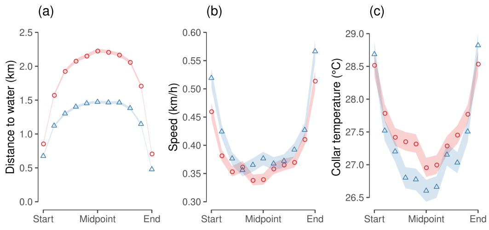

# Kruger Elephant Movement

## About this project

The map shows elephant movement across the thermal landscape of Kruger National Park, South Africa.

As a research assistant with [Maria Thaker](https://mariathaker.weebly.com/) and [Abi Vanak](https://www.atree.org/users/dr-abi-tamim-vanak), I worked on cleaning up some previous work on elephant movement in response to temperature.

Our work was published as

Thaker M, Gupte PR, Prins HHT, et al (2019) Fine-Scale Tracking of Ambient Temperature and Movement Reveals Shuttling Behavior of Elephants to Water. Front Ecol Evol 7:. doi: 10.3389/fevo.2019.00004

Link to the paper: [Thaker, Gupte, et al. (2019)](https://www.frontiersin.org/articles/10.3389/fevo.2019.00004/full)

Essentially, we showed that:

1. Temperature loggers integrated into GPS collars are sufficiently good measures of environmental temperature. They aren't they best solution, but they can be used to examine the effects of temperature on movement in a study that wasn't necessarily designed with this goal.
2. Kruger elephants move faster the warmer it gets, and slower in wooded regions.
3. Elephants make cyclical visits to water sources, to which they arrive and leave at high speed, as our figure 6 showed:

### Workflow

1. Run the numbered `.Rmd` files and iPython notebook, in the order of numbering.

### Reproducibility

I tried making the entire process fully reproducible via a Docker image.
I eventually decided against it because the image ended up at 2.5 GB, and I don't believe in using up too much storage space.

While most aspects of this project are reproducible, the further one gets from the actual mapping code, the less reproducible it gets.

On the plus side:

1. An Renv lockfile from which package versions used here can be restored.
2. Reproducible code including downloading data from Movebank, and getting landscape data from OpenStreetMap and Google Earth Engine's LANDSAT copies.

What isn't easy to replicate:

1. Some layers of the data are not in a publicly citable repository or similar, and had to be acquired by asking personally. This includes the Kruger boundaries, and the locations of 
waterholes.
2. The primary collection of the tracking data itself cannot be replicated. These elephants were collared in 2007 -- 2009. Are they still around? Possibly. Could we entirely reproduce the study by finding, collaring, and following them again? Probably not. 
3. The primary data _has_ to be taken with trust in the authors/researchers. The original dataset I received had issues! The geographic and UTM coordinates did not correspond for some individuals. This needed to be fixed. This is covered in the code for the original project: https://pratikunterwegs.github.io/elephantTempKruger/preliminary-data-preparation.html
It it this repaired (but not otherwise cleaned) data that was uploaded to Movebank.

## Data access

This dataset tracks 14 adult female elephants over some 2 years in Kruger National Park, South Africa, and has been used for a number of projects, including seasonal movements, movement in response to fire, and in response to the thermal landscape.

These projects were led by [Rob Slotow*](https://www.ucl.ac.uk/biosciences/people/professor-rob-slotow), [Maria Thaker](https://mariathaker.weebly.com/), and [Abi Vanak](https://www.atree.org/users/dr-abi-tamim-vanak). See the data access section for citation details.

I worked on this data in 2017 -- 2018 while a research assistant with Maria Thaker and Abi Vanak at CES, IISc, and ATREE, in Bangalore, India.
I also uploaded the data to Movebank in 2018, and together with Candace Vinciguerra from Movebank, published the dataset under the project leaders' names in the data repository. The data now forms part of the _Movebank_ homepage animation, which is very cool to see.

The tracking dataset collected for use in this work is available from Movebank: https://doi.org/10.5441/001/1.403h24q5 and can be cited as

Slotow R, Thaker M, Vanak AT (2019) Data from: Fine-scale tracking of ambient temperature and movement reveals shuttling behavior of elephants to water. Movebank Data Repository. doi:10.5441/001/1.403h24q5

### Landscape data

I used LANDSAT 5's surface reflectance product (band 6) to get the morning temperature over Kruger. The final single-raster data layers is the two year mean, with cloud cover removed. Landsat 5 has anomalies in its images which are fortunately not over Kruger, or at least don't affect scenes over Kruger too much. By my calculations (in 2018), Landsat 5 passed over Kruger at around 9 am in the morning, every two weeks or so. I might be mistaken.

The LANDSAT 5 surface reflectance thermal band (Band 6) is available from Google Earth Engine, and while USGS is unclear what the citation should read, this seems okay

U.S. Geological Survey, 2015, Landsat surface reflectance data (ver. 1.1, March 27, 2019): U.S. Geological Survey Fact Sheet 2015-3034, 1 p., https://doi.org/10.3133/fs20153034.

Other landscape data (waterholes and Kruger boundary) were provided by Maria Thaker and Abi Vanak, originally from SANParks.

I accessed the rivers from [OpenStreetMap](https://www.openstreetmap.org), and I show only the non-seasonal rivers (as determined by OSM contributors).

## Published work

This dataset was used in Thaker M, Gupte PR, Prins HHT, et al (2019) Fine-Scale Tracking of Ambient Temperature and Movement Reveals Shuttling Behavior of Elephants to Water. Front Ecol Evol 7:. doi: 10.3389/fevo.2019.00004

Link to the paper: [Thaker, Gupte, et al. (2019)](https://www.frontiersin.org/articles/10.3389/fevo.2019.00004/full)

---

* Rob Slotow's page at UKZN (and UKZN pages generally) appear to be down.
