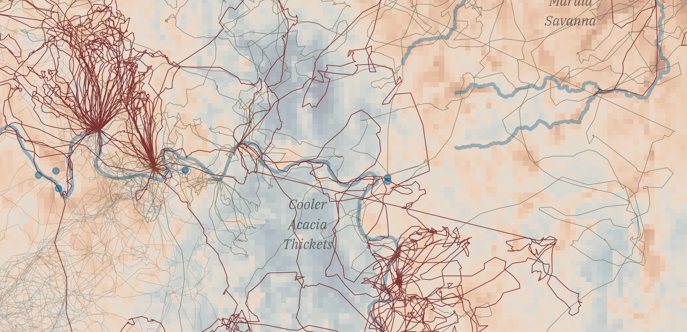
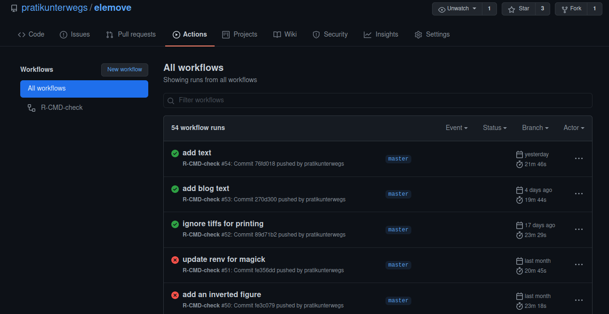

# Mapping Animal Movement in `R`: The Science and the Art

## Introduction

In December 2020 I was pointed to the BES Mapping Animal Movements Contest, and the "R Map" category stood out to me.
I decided to enter a map made showing the movement of 14 savanna elephants _Loxodonta africana_ tagged in Kruger National Park, South Africa.

The map highlights the path of the female elephant _AM253_ (the tag number). Some of the thirteen other elephants are also shown to give a sense of how densely Kruger is criss-crossed by elephant herds.
The background shows the average temperature sensed by the LANDSAT-5 satellite over the two year period of this study.

This data was part of the postdocs of [Maria Thaker](https://mariathaker.weebly.com/) and [Abi Vanak](https://www.atree.org/users/dr-abi-tamim-vanak), for whom I worked between my masters and my PhD. We wrote a [paper about how Kruger elephants move in response to temperature](https://www.frontiersin.org/articles/10.3389/fevo.2019.00004/full).

The source code and the figures can be found here: https://github.com/pratikunterwegs/elemove

## Mapping as Exploratory Data Analysis

Mapping animal movements is a key component of exploratory data analysis.

It's important to 'joining the dots' of animal positions. Large tracking datasets can contain errors that are only evident to researchers when they look at an approximation of the animal's path and ask, ["Does the animal move this way?"](https://wildlife.onlinelibrary.wiley.com/doi/abs/10.1111/j.1937-2817.2010.tb01258.x)

For instance, this map shows 'jumps': long, linear segments between points, which indicate missing data for some periods. Mapping can also reveal interesting behaviours that can only be observed after significant effort in the field.

For instance, the 'looping' behaviour of AM253 to water sources is the focus of this map.
Seeing this looping behaviour allowed us to focus our study on elephant movements between visits to water sources.

 <figure>
  
  <figcaption>Mapping the data and seeing the 'loops' led us to focus on visits to water sources, an interesting biological phenomenon. The long, straight lines instead indicate a non-biological phenomenon, likely missing data between two time periods.</figcaption>
</figure> 

## Mapping as Art

As with many other areas of science (other than primary data collection, please!): when in doubt about maps, copy.

Growing up in early 2000s India, I read hard copies of _National Geographic Magazine_, which has long had fantastic graphics. [_Where the Animals Go_](http://wheretheanimalsgo.com/) was a source of inspiration as well.

I picked up other tips and tricks from knowing something of art generally: build up an image in layers, use colours that don't clash, highlight the phenomenon of interest.
Interestingly, some of these approaches are very much in line with the ['grammar of graphics' approach of `ggplot`](https://vita.had.co.nz/papers/layered-grammar.html), which I used to make this map.

## Mapping in R

### Getting temperature data aka Flirting with Python

I used LANDSAT-5 for the temperature layer because it was the appropriate satellite for the time period (2007), and had a decent spatial resolution (30 metres). I used [Google Earth Engine (GEE)](https://earthengine.google.com/) to acquire this data. The heavy computation happens on the GEE servers, significantly increasing speed. By collecting these data for use at one point, GEE also improves data accessibility.

I used Python to get the LANDSAT-5 data from Google Earth Engine, using the `ee` package, which is [the Python GEE API package](https://developers.google.com/earth-engine/guides/python_install). The [`rgee` R package](https://r-spatial.github.io/rgee/) is similar, but works via Python, so I used Python directly.

I found Qiusheng Wu's [`geemap` package](https://github.com/giswqs/geemap) a great tool for visualisation of the data I was working with, and the associated tutorials a very good resource for help with `ee` generally.

### Getting elephants and boundaries

In 2019, we published the data on the [Movebank data repository](https://www.movebank.org/cms/movebank-main) (It now forms part of the animation on the starting page).
Getting the data was thus very easy using the `move` package, which I then saved as a geopackage.

I acquried the river course data using the [`osmdata` package](https://docs.ropensci.org/osmdata/), which queries and retrieves data from the OpenStreetMap database. The boundaries of Africa and South Africa come from the [`rnaturalearth` package](https://docs.ropensci.org/rnaturalearth/).
The Kruger boundary and the locations of waterholes originally come from the South African National Park service.

### Choosing Tools

R's great advantage over other languages is visualisaton, specifically the popular `ggplot` package. `ggplot`'s emergence as a mainstay of spatial visualisation is due to its `geom_sf` function, which can handle `sf` spatial objects.

One of `ggplot`'s advantage's is its many extensions. Here, I used the [`ggspatial`](https://github.com/paleolimbot/ggspatial/) and [`ggtext`](https://github.com/wilkelab/ggtext) extension packages to add the scale bars and north arrow, and to add the text box, respectively.

Plotting rasters is not straightforward in `ggplot`. There are two main options: the [`stars` package](https://r-spatial.github.io/stars/) and its associated `geom_stars`, or converting a raster dataset into a dataframe with regular coordinate intervals and using `geom_tile`.

Here, I chose the second approach because I'm an infrequent `stars` user; since making the map I've tried `geom_stars` which works just as well, and is very convenient.

### Choosing Colours

I coloured the temperature raster using the [`scico` package's](https://github.com/thomasp85/scico) 'VikO' palette. I tried out a number of palettes from the `scico`, `pals` (providing the [Kovesi palettes](https://peterkovesi.com/projects/colourmaps/)), `RColorBrewer`, and `colorspace` packages.
I chose a diverging palette to show heterogeneity in the thermal landscape, but this approach is not to be recommended for material that will be printed in grayscale.

## Reproducibility in R

I adopted a relatively relaxed understanding of reproducibility: given the data, the code would be reproducible if it could produce the map I had entered for this contest. To do this, I set up a continuous integration pipeline using [Github Actions (GHA)](https://github.com/features/actions).

Using the [`usethis` package, I created a `DESCRIPTION` file](https://www.rostrum.blog/2020/08/09/ghactions-pkgs/), which is usually reserved for packages. This file tricks GHA into reading its contents, especially the dependencies, i.e., the R packages required by the project.

GHA automatically reads the dependencies and installs them, as well as the programs required by those dependencies. For instance, GDAL (the Geospatial Data Abstraction Library) is key to nearly all spatial analyses, and is installed as a requirement of the `rgdal` package, which is itself key to `sf` and `raster`.

I used the R package [`renv`](https://rstudio.github.io/renv/) to make sure that the packages (and the package versions) I used are available to the pipeline. `renv` creates a lockfile, a registry of packages the current project uses, from which those packages can be installed.

Finally, to check whether the entire pipeline works, I used `bookdown` to sequentially execute the series of Rmarkdown files. An obvious alternative is `rmarkdown`.

GHA runs this pipeline and reports whether the code ran successfully, and if not, where it failed (you can see these reports [here](https://github.com/pratikunterwegs/elemove/actions)).

GHA runs the pipeline on Linux, and Windows containers (Mac OS-x is also supported). This means that though I use Linux, I'm pretty sure that this code works for Windows users.

 <figure>
  
  <figcaption>Github Actions is a 'freemium' service that automatically checks whether the code pipeline I've put in place is sufficient to recreate the map.</figcaption>
</figure> 

## The Limits of Reproducibility

Reproducibility inevitably breaks down at certain scales.
For instance, it would impossible to reproduce the primary data collection of the study, such as which elephants were captured and fitted with transmitters.
These data are taken on faith from the original researchers, highlighting the role of trust in the scientific community.

Code too is not exempt from reproducibility limits. For instance, restoring the `renv` lockfile is very difficult without an internet connection, as packages may need to be downloaded.
In ten years, code in R or another language may no longer be reproducible due to software and hardware changes, as many researchers found in the [10-year reproducibility challenge](https://www.nature.com/articles/d41586-020-02462-7). 

Finally, entire services might become unavailable; for example, the raster processing using Google Earth Engine, is dependent on Google maintaining this service.

Researchers then, should be pragmatic about reproducibility. Who is it for --- the researcher themselves, the reviewers of their manuscript, their students, their funders? To whom is this effort owed, and by whom, and how can the additional work required be prevented from becoming a gatekeeping mechanism [(1)](https://www.wired.com/2017/06/diversity-open-source-even-worse-tech-overall/), [(2)](https://www.pnas.org/content/117/39/24154)? These are issues that the ecology and evolution community will have to address.
